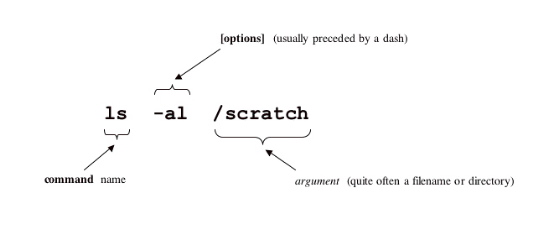

## Why command line?

- core skill
- simple
- powerful
- lasting
- universal
- hackable
- fun

## Level 1: Finding your way

```
ls
ls -l
pwd
man man (q to exit)
mkdir test/
cd test
cd ..
cd ~
cd /
```

Notes: Tab complete everything. Do not advance until you understand the difference
between relative and absolute paths.

Explore: [Filesystem Hierarchy Standard](http://www.pathname.com/fhs/)

Bonus: `pushd`, `popd`, `cd -`

## Level 2: Files and folders

```
man man
mkdir
touch filename
cp oldpath/oldfile newpath/newfile
mv oldpath/file newpath/file
rm -ri path/filname
```



> *Figure 1*: Anatomy of a UNIX Command. Via [Texas A&M High Performance Research Computing](http://web.archive.org/web/20150529023907/http://sc.tamu.edu/help/general/unix/unix.html)

Notes: Think of the syntax as "verb, adverb, object noun". Man everything. Rename with mv. 

Explore: [Take the Linux Filesystem Tour](http://web.archive.org/web/20140224004333/http://tuxradar.com/content/take-linux-filesystem-tour#null)

### Level 3: Search
up and down to cycle through history, `history`, pipes!, `history | less`, `history | grep "test.txt"`, `nano`, `cat`

Bonus: `ctrl-r`, repeat to cycle

### Level 4: Advanced
`grep`, `find`, `awk`

Note the complimentary use of `-print0` and `-0` to handle white spaces in file names.
`find -name "*.pdf" -print0 | xargs -0 lpr`

## Misc Notes
### Files and Folders 
- `ls *.md | wc -l` to count the number of .md files in a directory
- to flatten directories in zsh run something like `mv folder-name/*/**/*(.markdown) .`

## Text manipulation in Bash\*

<sub>* Bash is the GNU Project's shell. Bash is the Bourne Again SHell. Bash is an
sh-compatible shell that incorporates useful features from the Korn shell (ksh)
and C shell (csh). It is intended to conform to the IEEE POSIX P1003.2/ISO
9945.2 Shell and Tools standard. It offers functional improvements over sh for
both programming and interactive use. In addition, most sh scripts can be run
by Bash without modification.</sub>
### Symbolic links
- Specifying symbolic links with just the target will implicitly create the link in the current directory (works for folders as well. Something like: `$ ln -s gDrive/Articles/` will create `Articles@`
