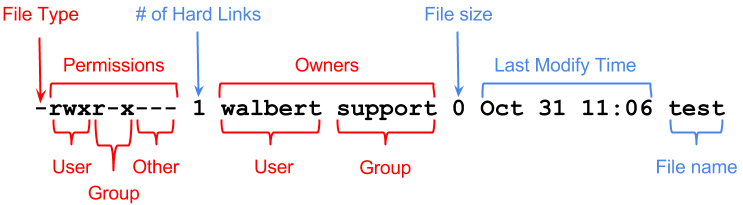

## Unit 3: Permissions

```
cd /
touch test.txt
sudo !!
cd -
touch test.txt
chmod u-w test.txt
nano test.txt
man sudo
```



> *Figure 2* Via
[Via UC Irvine](http://www.ics.uci.edu/computing/linux/file-security.php)

**Notes**: Think twice before sudo. The user flags are `u` for user, `g` for
group, `o` for other, `a` for all. The permission flags are `r` for read, `w`
for write, and `x` for execute. `chmod -x test.sh` implies `chmod a-x text.sh`.

**Explore**: [IBM developerWorks: Manage file permissions and ownership](http://www.ibm.com/developerworks/library/l-lpic1-v3-104-5/)

**Bonus**:

octal | decimal   | ls -l |permission
------|-----------|-------|--------------
000   | 0 (0+0+0) | ---   | none
001   | 1 (0+0+1) | --x   | execute
010   | 2 (0+2+0) | -w-   | write
011   | 3 (0+2+1) | -wx   | write + execute
100   | 4 (4+0+0) | r--   | read
101   | 5 (4+0+1) | r-x   | read + execute
110   | 6 (4+2+0) | rw-   | read + write
111   | 7 (4+2+1) | rwx   | read + write + execute

Instead of `chmod +rwx test.txt` (give everyone permissions to everything) you can
use `chmod 777 text.txt`.

